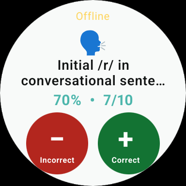
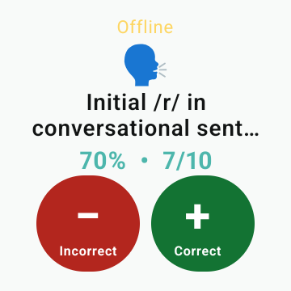

# Smartwatch support: Galaxy Watch7 vertical slice

## Feasibility decision

The synchronized watch controller must be native.

Samsung Browser is available for Galaxy Watch4 and newer Wear OS watches and can render ordinary JavaScript pages. Samsung does not publish a watch-specific guarantee for installable PWAs, service-worker lifetime, background execution, wake lock, vibration, or durable offline recovery. More importantly, watch-browser `localStorage` is isolated from phone-browser `localStorage`. Opening the current PWA on the watch would create a second dataset.

The first safe implementation therefore uses:

- a Compose for Wear OS app on the watch;
- an Android phone container that runs the existing web interface;
- a phone-side authoritative active-session ledger;
- the Wearable Data Layer for redacted state and operation delivery;
- an explicit JSON backup import when moving from the existing browser PWA to the Android container.

The current web deployment has a manifest but no service worker. It must not be described as offline-cached until a service worker and cache tests are added.

## Device support matrix

| Device or route | Status | Evidence and limits |
|---|---|---|
| Samsung Galaxy Watch7 44 mm LTE | Targeted | The model launched on Wear OS 5. The app supports Wear OS 3/API 30 and later. Confirm the watch's installed Wear OS and One UI Watch versions on the real device. |
| Wear OS small round, API 34 | Automated | Official Wear OS 5 Android emulator screenshot job plus APK build. This is the closest automated shape check for the Galaxy Watch7. |
| Wear OS square, API 34 | Automated | Official Wear OS 5 Android emulator screenshot job verifies the smallest rectangular configuration. |
| Android phone with Google Play services, Android 11+ | Targeted | Required for the Data Layer and phone authority. Exact paired phone model and Android version still need confirmation. |
| Samsung Browser on the watch | Browser page only | Not supported for synchronized data collection. Its storage is separate and its watch-specific PWA/background guarantees are insufficient. |
| Chrome or Samsung Internet phone PWA | Existing app | Continues to work unchanged, but cannot communicate directly with the native watch app. Export a backup and import it into the Android container before watch use. |
| iPhone paired with Wear OS | Unsupported | The Wearable Data Layer is Android/Wear OS only. |

## Implemented vertical slice

1. Start or resume a session in the Android phone container.
2. The phone stores the complete active session in its private authoritative ledger.
3. The watch receives a redacted state containing no client label.
4. The watch shows the current target, target icon, running accuracy, and separate correct/incorrect controls.
5. Each tap gets a stable UUID, enters a persistent ordered watch queue, and displays `Syncing` or `Offline • n queued`.
6. The phone serializes phone and watch writes, rejects invalid operations, records accepted operation IDs, and durably commits before acknowledgement.
7. Retrying an accepted operation ID returns success without creating another trial.
8. A persistent Data Item returns the authoritative count and accepted operation ID. Only then does the watch show the saved count and confirmation haptic.
9. When the phone screen returns, the web session reconciles from the native authority.

This PR intentionally leaves cue selection, undo, target switching, and session ending on the watch for the next vertical slice. Session ending remains phone-only. The watch does not show client labels, history, graphs, templates, backups, settings, or goal-management screens.

## Session ownership and synchronization contract

### Ownership

- Normal browser use: that browser's `localStorage` owns its sessions. No watch control is available.
- Android container use: the native phone ledger owns the active session. Web storage inside the container is a mirror for the existing UI and history model.
- Watch storage: owns only a temporary operation queue and a redacted display-state cache. It never owns the clinical session.
- Ended sessions: the container mirrors the final authoritative session into the existing web data model.

### Trial operation

```json
{
  "id": "stable-operation-uuid",
  "session_id": "session-id",
  "type": "trial",
  "datapoint_id": "stable-operation-uuid",
  "target_id": "target-id",
  "result": "+",
  "prompt_levels": [],
  "timestamp": "2026-08-24T12:00:00Z",
  "source": "watch"
}
```

### Acceptance rules

- Package name and signing certificate must match on phone and watch.
- The operation ID and session ID are required.
- The session must be active and owned by the phone ledger.
- The target must belong to that session.
- Results are restricted to `+` or `-`.
- Cue labels are filtered against the phone's configured cue list.
- A previously accepted operation ID is acknowledged as a duplicate without another write.
- Phone and watch operations enter the same synchronized commit boundary.
- The watch sends one queued operation at a time, preserving order across retries.
- Message delivery is never treated as a save acknowledgement. The durable Data Item containing `last_accepted_operation_id` is the acknowledgement.
- Failed and rejected operations remain visible and are not reported as saved.

### Connection states

| State | Meaning |
|---|---|
| Connected | The latest authoritative state is present and no action is queued. |
| Syncing | One or more actions await authoritative acknowledgement. |
| Offline | No paired node is reachable; actions remain queued in order. |
| Not saved | The phone rejected the first queued action. User action or diagnosis is required. |

The Data Layer may use Bluetooth, Wi-Fi, or Google's end-to-end encrypted cloud relay. It is a transport between the paired apps, not a general backup or multi-user synchronization service.

## Build and emulator testing

1. Open `android/` in Android Studio or install Gradle 8.13 and JDK 17.
2. Build both apps:

   ```bash
   gradle --project-dir android :phone:testDebugUnitTest :phone:assembleDebug :wear:assembleDebug
   ```

3. Install `phone-debug.apk` on the paired Android phone and `wear-debug.apk` on the watch. Both APKs must use the same build/signing identity.
4. Export a JSON backup from the existing browser PWA. Open the Android container and import that backup before starting a watch-controlled session.
5. Start a session on the phone. Open Data Taker on the watch and record one correct and one incorrect response.
6. Confirm that each watch action says `Syncing` before acknowledgement, then updates both displays to the same count.
7. Turn off Bluetooth and Wi-Fi, record an action, and confirm it remains queued. Reconnect and confirm exactly one new trial appears.
8. Retry the same operation in automated tests and confirm no duplicate trial.

The `Smartwatch` GitHub workflow builds the phone and watch APKs, runs native authority and persistent-queue tests, launches official API 34 Wear OS 5 emulators using `wearos_small_round` and `wearos_square`, and uploads screenshots as workflow artifacts. Queue tests cover restart persistence, action order, delayed acknowledgements, and unknown acknowledgements; authority tests cover duplicate and delayed retries.

## Emulator screenshots

These screenshots were captured by the official Wear OS 5/API 34 emulator jobs from the same native watch APK. Client labels are not present in the watch state or images.

| Small round | Small rectangular |
|---|---|
|  |  |

## Real Galaxy Watch7 checklist

- Record the watch model number, Wear OS version, One UI Watch version, phone model, and Android version.
- Confirm the phone and watch apps install with the same signing identity.
- Verify round-edge clearance and the 64–72 dp controls on the 44 mm display.
- Test system font sizes, TalkBack, light/dark system appearance, high-contrast text, and reduced motion.
- Test screen sleep, wrist-down ambient transition, app close/reopen, Bluetooth loss, Wi-Fi/LTE relay, and phone process death.
- Record at least 20 rapid alternating trials and confirm ordered, duplicate-free counts.
- Confirm no client label or other identifying text appears in watch UI, logs, screenshots, or Data Items.
- Confirm battery use during a typical treatment session and verify no wake lock is held.

Real-device validation remains required before the draft PR can be marked ready or merged.
